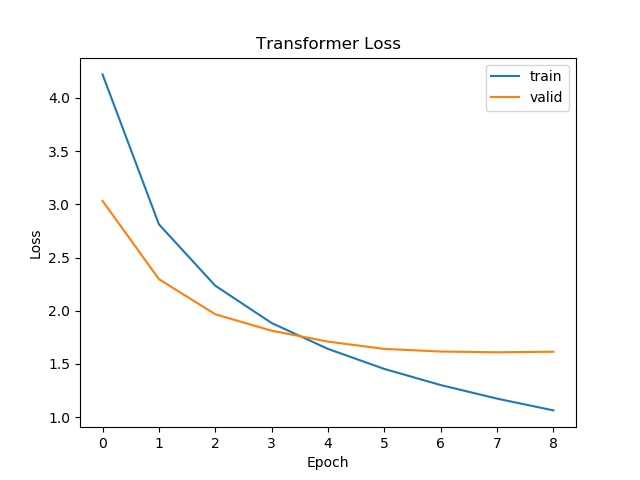
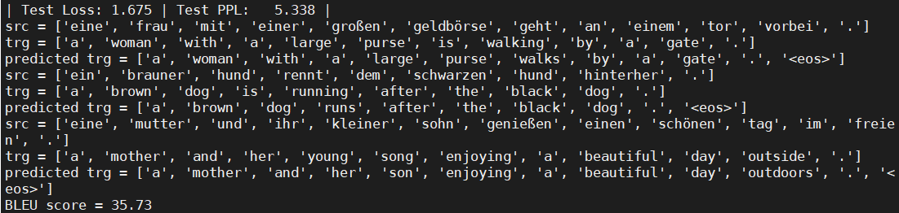
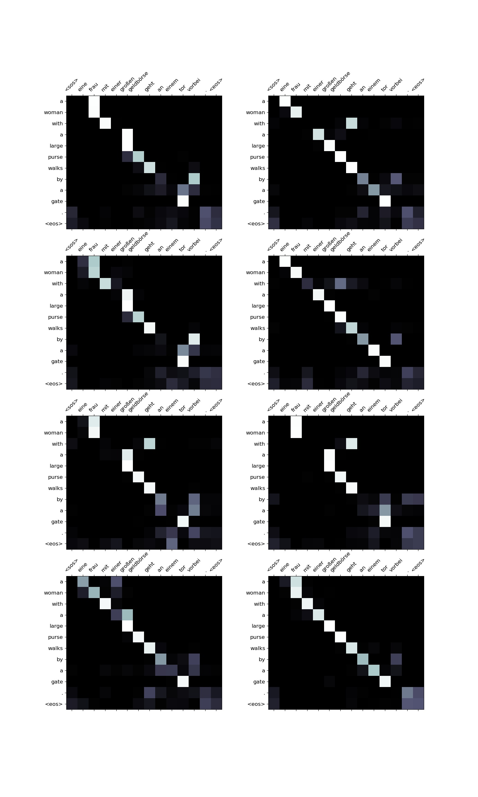
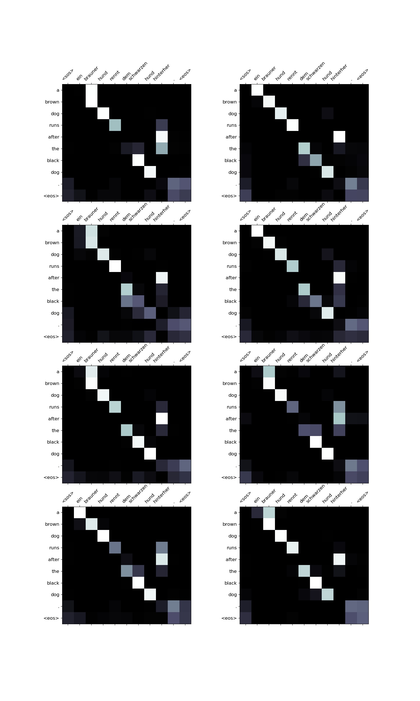
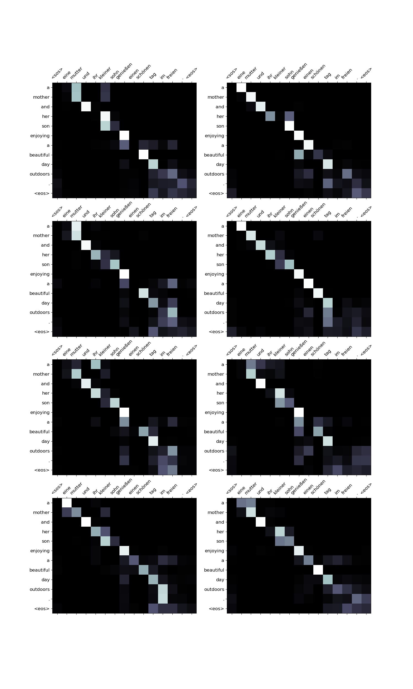

# Requirement

- python 3.x
- pytorch 1.3.1+cu92
- torchtext 0.6.0
- spacy 2.2.2
- matplotlib
- numpy 1.17.2

To run pytorch on a gpu machine:

```
conda install pytorch torchvision cudatoolkit=10.2 -c pytorch
```

To install torchtext:

```pip install torchtext
pip install torchtext
```

Before we run the transformer.py, CNN.py and RNN.py, we should download the spacy language model:

```python -m spacy download en
python -m spacy download en
python -m spacy download de
```

To run python file:

```
cd transformer
python transformer.py
```

If you find the code is difficult to read, please read the 'transformer with comments.py' which has Chinese annotation and other details.

# Dataset

Here we use <a href = 'https://torchtext.readthedocs.io/en/latest/datasets.html?highlight=multi30k#multi30k'>Multi30k</a> dataset in tochtext.datasets:

```
from torchtext.datasets import Multi30k
```

It is a small-dataset WMT 2016 multimodal task, also known as Flickr30k.

# Experiment

We perform three experiments on <a href='https://arxiv.org/abs/1406.1078'> RNN</a>, <a href = 'https://arxiv.org/abs/1705.03122'>CNN</a> and <a href='https://arxiv.org/abs/1706.03762'>Transformer</a>. Here we show some results of our experiments. Transformer model is from the  <a href='https://arxiv.org/abs/1706.03762'>Attention is All You Need </a>paper.

## RNN

### Parameter Number


We have 20,518,917 parameters to train.

### Loss

As we use a small dataset, 8 epoch is enough for out model.


### Results


Here we show three samples for our train_data, valid_data and test_data. 'trg' is the true target sentence, while 'predicted trg' if the predicted sentence using our model.

For train_data:

```
trg = ['a', 'black', 'dog', 'and', 'a', 'spotted', 'dog', 'are', 'fighting']

predicted trg = ['a', 'black', 'dog', 'and', 'a', 'spotted', 'dog', 'fighting', '.', '<eos>']
```


For valid_data:

```
trg = ['a', 'female', 'playing', 'a', 'song', 'on', 'her', 'violin', '.']

predicted trg = ['a', 'woman', 'playing', 'a', 'song', 'on', 'her', 'violin', '.', '<eos>']
```


For test_data:

```
trg = ['the', 'person', 'in', 'the', 'striped', 'shirt', 'is', 'mountain', 'climbing', '.']

predicted trg = ['the', 'person', 'in', 'the', 'striped', 'shirt', 'is', 'climbing', 'on', 'a', 'mountain', '.', '<eos>']
```


### BLEU score

BLEU score = 28.22

## CNN

### Parameter Number


We have 37,351,685 trainable parameters.

### Loss


### Results


For train_data:

```
trg = ['a', 'little', 'girl', 'climbing', 'into', 'a', 'wooden', 'playhouse', '.']

predicted trg = ['a', 'little', 'girl', 'is', 'climbing', 'into', 'a', 'playhouse', 'made', 'of', 'wood', '.', '<eos>']
```


For valid_data:

```
trg = ['a', 'boy', 'wearing', 'headphones', 'sits', 'on', 'a', 'woman', "'s", 'shoulders', '.']

predicted trg = ['a', 'boy', 'in', 'headphones', 'sits', 'on', 'the', 'shoulders', 'of', 'a', 'woman', '.', '<eos>']
```


For test_data:

```
trg = ['a', 'man', 'in', 'a', 'vest', 'is', 'sitting', 'in', 'a', 'chair', 'and', 'holding', 'magazines', '.']

predicted trg = ['a', 'man', 'in', 'a', 'vest', 'is', 'sitting', 'on', 'a', 'chair', 'holding', '<unk>', '.', '<eos>']
```


### BLEU score

BLUE score = 34.40

## Transformer

### Parameter Number


We have 9,038,853 trainable parameters.

### Loss



### Results



For train_data:

```
trg = ['a', 'woman', 'with', 'a', 'large', 'purse', 'is', 'walking', 'by', 'a', 'gate', '.']

predicted trg = ['a', 'woman', 'with', 'a', 'large', 'purse', 'walks', 'by', 'a', 'gate', '.', '<eos>']
```



As we have 8 heads in Multi-head Attention mechanism, so here we get 8 different attention graph.

For valid_data:

```
trg = ['a', 'brown', 'dog', 'is', 'running', 'after', 'the', 'black', 'dog', '.']

predicted trg = ['a', 'brown', 'dog', 'running', 'after', 'the', 'black', 'dog', '.', '<eos>']
```



For test_data:

```
trg = ['a', 'mother', 'and', 'her', 'young', 'song', 'enjoying', 'a', 'beautiful', 'day', 'outside', '.']

predicted trg = ['a', 'mother', 'and', 'her', 'son', 'enjoying', 'a', 'beautiful', 'day', 'outside', '.', '<eos>']
```



### BLEU score

BLEU score = 35.73


# Summary

Now we can compare the three models:

|             |             #Parameter             |           BLEU score           |
| :---------: | :--------------------------------: | :----------------------------: |
|     RNN     |             20,518,917             |             28.22              |
|     CNN     |             37,351,685             |             34.40              |
| Transformer | <font color = red>9,038,853</font> | <font color = red>35.73</font> |

# Reference

- https://github.com/bentrevett/pytorch-seq2seq
- https://github.com/tensorflow/tensor2tensor
- https://mp.weixin.qq.com/s/RLxWevVWHXgX-UcoxDS70w
- http://jalammar.github.io/illustrated-transformer/

